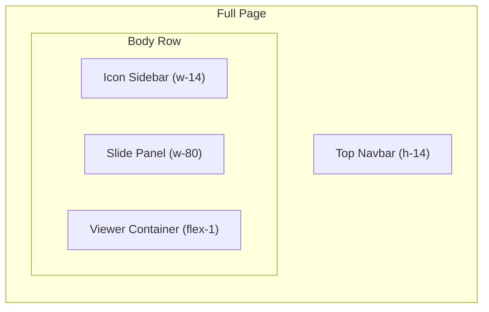
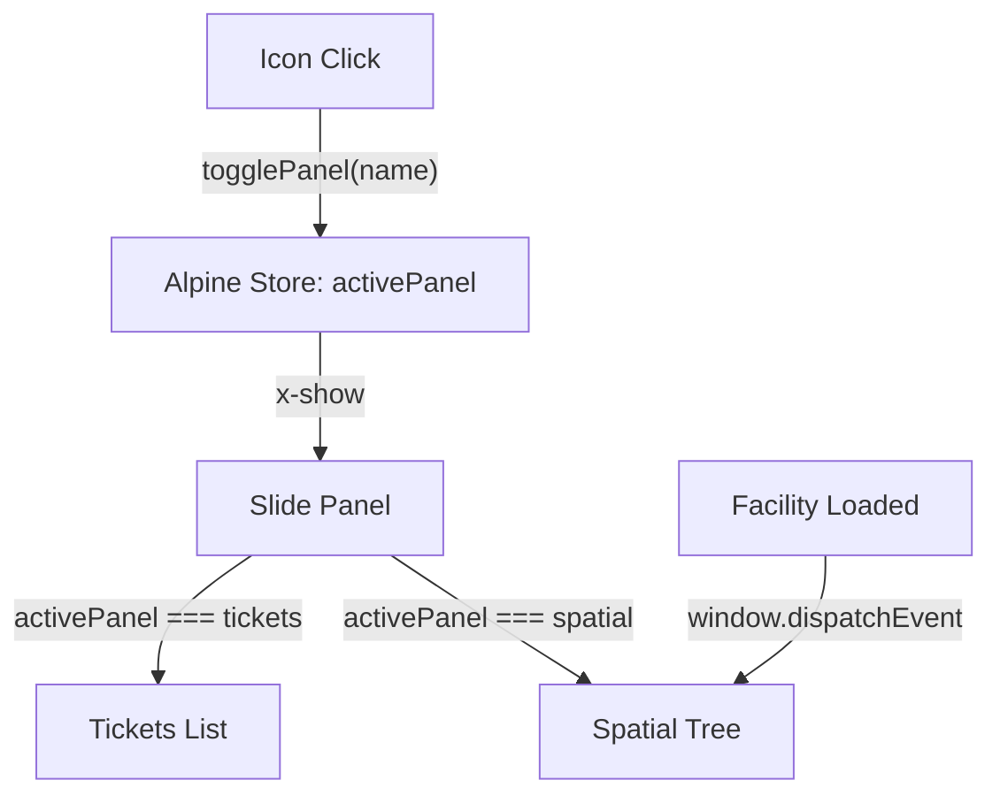

# Tandem Viewer UI Redesign with Alpine.js + Tailwind

## Layout

- **Top navbar**: Logo left, account/facility selects center, search box, user profile avatar (right)
- **Left icon sidebar**: Narrow vertical strip (~56px) with icon buttons stacked vertically
- **Slide-out panel**: 320px panel that opens between the icon bar and the viewer when an icon is clicked; closes when clicking the same icon again
- **Viewer**: Fills remaining space

## Technology

- **Alpine.js** (CDN) -- lightweight reactivity for panel toggling, tree expand/collapse, tab state
- **Tailwind CSS** (CDN play) -- utility classes, dark theme, no build step needed
- **Heroicons** -- inline SVG icons (clipboard/ticket, building, layers, etc.)
- No npm additions required; both loaded via CDN `<script>` tags

## File Changes

### 1. `www/index.html` -- Full rewrite of markup and styles

Replace all custom CSS with Tailwind utilities. The `<body>` gets `x-data` for the root Alpine store. Structure:

- `<nav>` -- Top bar with:
  - Autodesk Tandem logo/text (left)
  - Account + Facility `<select>` dropdowns (center-left)
  - Search input (center)
  - User profile circle with initials (right)
- `
` -- Main content row:
  - **Icon sidebar** (`w-14 bg-gray-900 flex flex-col`) -- icon buttons for: Tickets, Spatial Browser, Isolate, Show All. Each toggles `activePanel` in Alpine state.
  - **Slide panel** (`w-80`, shown via `x-show="activePanel"`, `x-transition`) -- content switches based on which icon was clicked:
    - **Tickets panel**: Header + scrollable list of placeholder ticket cards (priority badge, title, date)
    - **Spatial panel**: Collapsible tree of Levels > Rooms using nested `x-data` and `x-show` for expand/collapse
  - **Viewer container** (`flex-1 relative`) -- existing viewer div, loading overlay

### 2. `www/src/main.js` -- Minimal changes

- Remove old DOM element refs for removed elements (`isolateBtn`, `searchInput`)
- Expose key functions to `window` so Alpine `@click` handlers can call them: `window.doIsolateAndFit`, `window.resetView`, `window.loadFacility`, etc.
- Keep all existing viewer init, facility loading, and isolate/fitToView logic intact
- `enableSearch()` renamed to `enableControls()` to update Alpine store instead of DOM disabled attrs

### 3. `www/src/panels.js` -- New file (~100 lines)

Alpine component definitions:

- `sidebarStore()` -- manages `activePanel` (null, 'tickets', 'spatial'), toggle logic
- `ticketsPanel()` -- mock ticket data array for demo display
- `spatialPanel()` -- levels/rooms tree data, loaded from facility after it loads; expand/collapse state per node

## Alpine.js Data Flow

## Icon Sidebar Buttons (top to bottom)

- **Tickets** (clipboard-document-list icon) -- opens tickets panel
- **Spatial** (building-office icon) -- opens levels/rooms tree
- **Divider**
- **Isolate** (viewfinder-circle icon) -- calls `doIsolateAndFit()` directly (no panel)
- **Show All** (eye icon) -- calls `resetView()` directly (no panel)

## Visual Style

- Dark theme: `bg-gray-950` body, `bg-gray-900` sidebar, `bg-gray-800` panels, `bg-gray-900/80` navbar
- Accent: Autodesk blue `#0696D7` (`sky-500`/`sky-600`) for active states and hover
- Icons: 24px, `text-gray-400` default, `text-sky-400` when active
- Panel transitions: `x-transition` slide from left
- Tree nodes: indented with chevron rotate animation on expand

